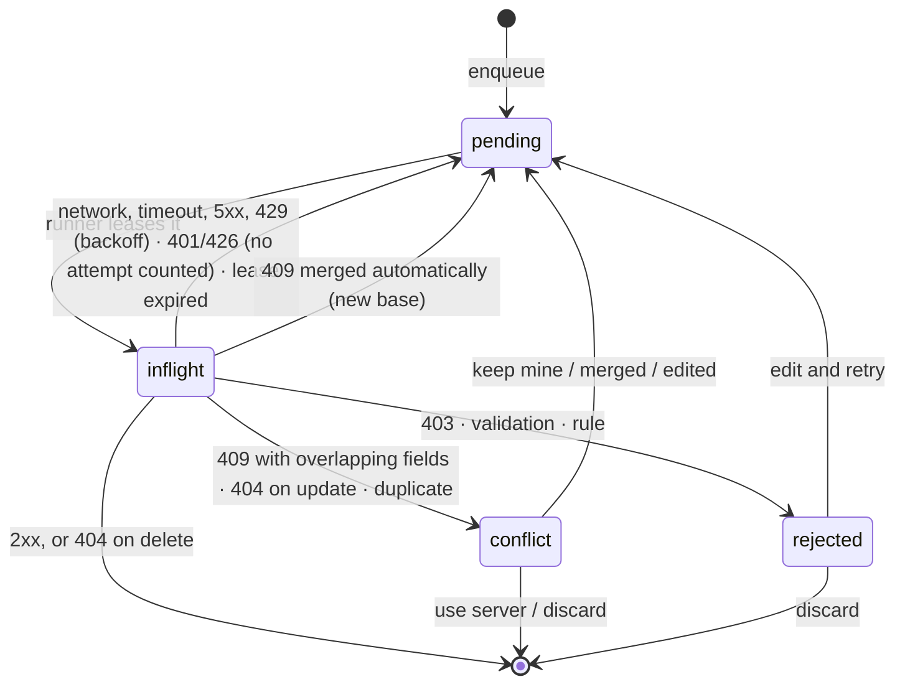

# Target architecture — server snapshot, durable outbox, projected views

[Global tracker](main.md) · [Findings](findings.md)

This replaces the offline pool (`storylens-sync-state` in `storage.local`), the two write paths, temporary IDs and dirty flags with a local-first design.

- The **snapshot** holds what the server last said.
- The **outbox** holds what the reader has done since.
- Every screen and the page read a **view**: the snapshot with the outbox applied on top.
- One background **runner** sends the outbox and refreshes the snapshot.

## Goals

1. **No lost writes.** Once a form closes as saved, the change survives closing the popup, restarting the worker or browser, going offline and updating the extension.
2. **One behavior online and offline.** The UI always reads local views and always writes through the outbox; being online only changes how soon the runner sends.
3. **Deterministic sync.** Sends are ordered per entity, aware of dependencies, idempotent and resumable after a crash.
4. **Honest conflicts.** Changes to different fields merge automatically. Real conflicts go to the reader with clear choices. Nothing is overwritten or dropped silently.
5. **Isolated failures.** A rejected change never blocks other changes, other novels or refreshes.
6. **Clean break (decision D13).** The backend, extension, desktop client and dashboard change together in one release, and older installs get 426 and update. There is no compatibility layer for older APIs or 3.2.x local data, and deprecated code and shims are removed ([inventory](main.md#compatibility-cleanup-inventory-d13)).

## Non-goals

- Real-time collaboration or character-level text merging (CRDTs).
- Offline editing of novels, website selectors and chapter biases. These are online-only tools (mostly for moderators) and are explicitly disabled offline ([phase 1](01-foundations.md)).
- A server batch sync endpoint (see [Alternatives](#alternatives-considered)).
- Compatibility with 3.2.x clients, API behavior or local data (D13).

## Vocabulary

| Term | Meaning |
| --- | --- |
| Snapshot | Dexie tables holding the last known server rows. Only server responses and pulls write them. |
| Outbox | The `mutations` table: the reader's unconfirmed changes, in order. |
| Mutation | One create, update or delete of one entity, with a client-generated ID. |
| View | Snapshot ⊕ the current account's unresolved mutations; what the UI and page highlighting read. |
| Runner | The background worker's sync loop: it pushes mutations and pulls snapshots under one lock. |
| Pinned novel | A downloaded novel: kept fresh by every sync run and never evicted. |
| Cached novel | A novel whose data was loaded for a page or the popup but not downloaded: refreshed when used. |
| Needs attention | Mutations in `conflict` or `rejected`, or waiting for another account. They need a decision from the reader. |

## Contexts and responsibilities

```text
┌────────────────────────── extension origin ───────────────────────────┐
│ Popup · launcher iframe · options          Background service worker  │
│  reads views (live updates)                 runner: push, pull, status│
│  enqueue() → Dexie transaction              alarms, badge, triggers   │
│  sends "syncKick" (best effort)             serves page data (views)  │
│                 │                                  │                  │
│                 └────── IndexedDB storylens-offline ┘                 │
│                 snapshot tables · mutations · novelSync · syncMeta    │
└───────────────────────────────────────────────────────────────────────┘
      ▲ messages (getNovelContentData, refreshContent)       │ HTTPS
┌─────┴──────── page origin ───────┐                  ┌──────┴───────┐
│ Content script: never opens      │                  │ /api/user/*  │
│ Dexie (it would get the site's   │                  └──────────────┘
│ database); asks the background   │
└──────────────────────────────────┘
```

- IndexedDB transactions are atomic across every extension context. That is why UI contexts may write the outbox directly, and why the old `storage.local` blob could not be made safe cheaply.
- Chrome does not partition storage for `chrome-extension://` pages embedded in sites ([Chrome docs](https://developer.chrome.com/docs/extensions/develop/concepts/storage-and-cookies)), so the launcher iframe shares the same database. Firefox must be verified ([phase 6](06-ui-integration.md)). If its embedded `moz-extension://` frames are partitioned, the iframe sends reads and writes through background messages instead.
- If IndexedDB cannot be opened (for example, Firefox with site data blocked), the extension falls back to an online-only mode with a banner instead of failing.

## Data model (new database `storylens`, schema version 1)

```ts
// A new database with one clean schema. 3.2.x's `storylens-offline` is deleted on update (D13).
this.version(1).stores({
  // Snapshot: server rows only, in the generated API shapes
  novels: "id",                    // the catalogue; downloaded ones are pinned in novelSync
  keywords: "id, novelId",
  keywordAliases: "id, keywordId",
  keywordVersions: "id, keywordId",
  replacements: "id, novelId",
  keywordCategories: "id",
  keywordNatures: "id",
  websiteNovelBiases: "id, novelId",
  // Local state
  mutations: "++seq, &id, entityId, novelId, status, userId, [userId+status]",
  novelSync: "novelId, pinned",
  syncMeta: "key",
  files: "id, mutationId", // phase 8: queued image uploads
});
```

- `novelSync` holds `{ novelId, pinned, lastPulledAt, refreshRequestedAt?, lastPullError?, removedOnServer? }`. Pinning lives in the same transaction as the novel's data, so a download can never be half-registered.
- `syncMeta` is a key-value table for the API protocol version, runner state, last successful push and pull times, and the catalogue and lookup pull times.
- Snapshot rows are the generated API types with no local flags. Indexes exist only for the queries the views run (by novel, by keyword); uniqueness is validated in code, as on the server.
- **Upgrading from 3.2.x is a fresh start** ([below](#upgrading-from-32x-fresh-start)): nothing from the old database or the old pool is read.

## Mutation

```ts
type SyncEntity =
  | "keyword" | "keywordAlias" | "keywordVersion" | "replacement"
  | "keywordCategory" | "keywordNature" | "file";

type MutationStatus = "pending" | "inflight" | "conflict" | "rejected";

type Mutation = {
  seq: number;                  // Dexie auto-increment: global order
  id: string;                   // UUID; also the idempotency key in logs
  userId: string;               // account that made the change
  userLabel: string;            // username, for "made while signed in as …"
  entity: SyncEntity;
  op: "create" | "update" | "delete";
  entityId: string;             // UUID generated on the client for creates
  novelId: string | null;       // null for categories, natures and files
  parentId?: string;            // keywordId for aliases and versions
  dependsOn: string[];          // entity IDs whose creates must be confirmed first
  patch: Record<string, unknown>;  // create: full body; update: changed fields only
  base?: Record<string, unknown>;  // update: values the reader saw for the patched fields
  baseUpdatedAt?: string;          // update: snapshot `updatedAt` when the edit started
  actor: { moderator: boolean };   // permissions at edit time (view rules and validation)
  createdAt: number;
  updatedAt: number;
  status: MutationStatus;
  attempts: number;             // transient failures only
  nextAttemptAt: number;        // backoff
  leaseUntil?: number;          // set while inflight
  lastError?: { status?: number; code?: string; message: string; at: number };
  conflict?: {
    kind: "stale" | "deleted" | "duplicate" | "rule" | "permission" | "parent-missing";
    server?: Record<string, unknown> | null;   // server row when known
    fields?: { field: string; base: unknown; mine: unknown; theirs: unknown }[];
  };
};
```

Stored statuses are few on purpose. The rest are derived when read, so switching accounts or losing the connection never rewrites the outbox:

| Derived state | Rule |
| --- | --- |
| Waiting | `pending` and `nextAttemptAt > now` |
| Blocked | An earlier mutation of the same entity, or a dependency's create, is unresolved |
| Other account | `userId` differs from the signed-in user; never sent or applied |
| Paused | The runner is in `authRequired` or `upgradeRequired`; nothing is sent |



## Write path — `enqueue()`

Every create, update and delete of a syncable entity goes through `enqueue()`. No UI code calls a write endpoint for these entities.

1. **Actor.** Read the stored user (`storylens-auth`). Guests and a missing session are refused before anything is written.
2. **One read-write transaction** over `mutations`, the novel's snapshot tables and the lookups:
   1. Build the entity's current view (snapshot plus this user's mutations for the entity, its parent and its novel).
   2. **Permission** (`rules/permissions.ts`, a mirror of the server):
      - Keywords and replacements: moderator or creator.
      - Alias and version *edits and deletes*: moderator, their own creator, or the creator of the **parent keyword** (decision D12).
      - Alias and version creates: any reader.
      - Categories and natures: moderators.
   3. **Validation** (`rules/validation.ts`, a mirror of the server):
      - Required fields.
      - Keyword name unique per novel and language; alias name unique per keyword; replacement `from` unique per novel, with no bidirectional pair.
      - Version start: readers need `currentChapter`; the start must come after the latest open version.
      - No deleting the base version or the only version.
      - No deleting a category or nature in use.
   4. **Diff.** An update keeps only the fields that differ from the values the form started with. `base` holds those starting values and `baseUpdatedAt` the row's `updatedAt` at that moment. An empty diff writes nothing.
   5. **Coalesce** with the entity's tail mutation when that tail is `pending` (never `inflight`), otherwise append:

      | Tail | New | Result |
      | --- | --- | --- |
      | create | update | Merge the fields into the create |
      | create | delete | Remove both, and drop the unsent mutations of rows created under it (aliases and versions of a new keyword) |
      | update | update | Merge fields; keep the tail's `base` for fields it already had and add the new ones |
      | update | delete | Replace with the delete |
      | keyword create | update of its base version | Merge description, category, nature and image into the keyword create |
      | inflight, conflict or rejected | anything | Append; the new mutation waits behind the tail |

   6. **Dependencies.**
      - Aliases and versions depend on the parent keyword.
      - Keywords, aliases and versions depend on their category, nature and image when those have unconfirmed creates.
3. **After commit** (best effort): send `syncKick` to the background and refresh the active tab's highlights. If the popup closes first, the mutation is already durable and the next trigger sends it.

IDs come from `crypto.randomUUID()`. A keyword create also generates `versionId`, the ID of its base version.

## Read path — views

`getNovelView(novelId)` returns the novel, its keywords (each with aliases and versions), replacements, chapter biases and a per-entity sync state (`pending`, `conflict`, `rejected`) for badges. `getLookupsView()` and `getCatalogueView()` do the same for categories, natures and novels. The projection is a **pure function** of snapshot rows plus mutations, so it is unit-tested without IndexedDB.

Projection rules mirror what the server will do, so the local result matches the synced result:

| Mutation | Applied to the view |
| --- | --- |
| Keyword create | Keyword plus base version (`versionId`, chapter 0 onward, with description, category, nature and image) |
| Keyword delete | Removes its aliases and versions; replacements pointing to it lose `keywordId` |
| Alias create or rename | Writes `nameAr`/`nameEn` directly, like keywords (the `name` column is removed in phase 2) |
| Version create | Readers start at `currentChapter`, moderators at the chosen start. The latest open version with a lower start gets `endingChapter = start − 1` |
| Version update | Chapter range changes apply only when `actor.moderator` (the server ignores them from readers) |
| Replacement create or update | Chain rewrite: rows whose `to` equals the new `from` get the new `to`. `keywordId` comes from a keyword whose name equals `to` |
| Any row | `createdById = userId`; `createdAt`/`updatedAt` from the mutation. Embedded `category`/`nature` objects are resolved from the lookups view, so renames and colors show on aliases too |

- **Stored text is raw.** Phase 2 stops the API from HTML-escaping stored text and decodes existing rows once (decision D11; [finding P13](findings.md)), so views, forms and page matching use exactly what the reader typed, with no decoding step. This is safe because no app inserts this text as HTML: React and text nodes render it.
- Every unresolved mutation of the current account applies (`pending`, `inflight`, `conflict`, `rejected`). The reader sees their intent until they resolve it, and the item carries a badge. Other accounts' mutations do not apply.
- Language filtering (`namedIn`) happens after projection, as today.
- Page data: the background builds the view for `getNovelContentData`. It caches views in memory by novel and invalidates them on every outbox or snapshot write (a `syncMeta` change counter).

## Runner

The runner lives only in the background worker.

### Triggers

| Trigger | Run |
| --- | --- |
| `syncKick` message (after enqueue, popup open, launcher open) | Push; pull stale units |
| Periodic alarm `storylens-periodic-sync` (the existing name, so no orphan alarm is left behind), created only if missing | Push; pull stale pinned novels and lookups |
| One-shot alarm `storylens-sync-retry` at the earliest `nextAttemptAt` | Push |
| `runtime.onStartup`, `runtime.onInstalled` (on update, after deleting the 3.2.x storage) | Push; pull stale units |
| Worker `online` event | Push |
| `storylens-auth` change | Resume from `authRequired`; push the new account's mutations |
| Manual **Sync now** | Push, including an immediate retry of waiting mutations; pull every pinned novel |

### One run

```text
navigator.locks.request("storylens-sync", { ifAvailable: true }, run)
  └─ if the lock is held: set syncMeta.rerun = true and return (the holder loops once more)
run:
  recoverExpiredLeases()                 inflight with leaseUntil < now → pending
  user ← stored auth; none → state "authRequired"; stop
  protocol ← GET /sync/protocol (cached one hour); older than required → state "apiOutdated"; stop
  pushLoop(until deadline ≈ 4 min)
  pullDueUnits(until deadline)
  write status, update the badge, schedule the retry alarm
  if syncMeta.rerun: clear it and run again
```

**pushLoop** repeats `pickNext → lease → send → applyOutcome`. It stops early on a network failure (offline or server unreachable), on 401 and on 426.

`pickNext` is a pure function over the outbox. It takes the lowest `seq` among mutations that:

- belong to the current user;
- are `pending` with `nextAttemptAt ≤ now`;
- have no earlier unresolved mutation of the same entity;
- have no unconfirmed create among their `dependsOn`.

Sends are sequential. A mutation that is waiting or blocked never stops the loop from sending other entities.

### Transport

Only this module calls write endpoints. Every request has a 20-second timeout.

| Entity × op | Request |
| --- | --- |
| Keyword create | `POST /keywords` with `id`, `versionId`, `novelId`, names, `matchingType`, `categoryId`, `natureId`, `description`, `imageId` |
| Keyword update | `PUT /keywords/:id` with changed fields and `baseUpdatedAt` |
| Alias create / update | `POST /keyword-aliases` with `id`, `keywordId`, `nameAr`/`nameEn` … / `PUT /keyword-aliases/:id` with changed fields and `baseUpdatedAt` |
| Version create / update | `POST /keyword-versions` with `id`, `keywordId`, `currentChapter` (and a range for moderators) / `PUT …/:id` with changed fields and `baseUpdatedAt` |
| Replacement create / update | `POST /replacements` with `id` … / `PUT /replacements/:id` with changed fields and `baseUpdatedAt` (partial, like every other update after phase 2) |
| Category or nature create / update | `POST` with `id` / `PUT` with changed fields and `baseUpdatedAt` |
| Any delete | `DELETE /…/:id` (unconditional; see the conflict policy) |
| File (phase 8) | `POST /files/upload` with `id`; the file keeps its client ID, so dependants need no rewriting |

### Outcomes

| Response | Outbox | Snapshot |
| --- | --- | --- |
| 2xx | Remove the mutation. Rebase the entity's later mutations: when their `base` values equal the new server values, set their `baseUpdatedAt` to the response's `updatedAt` | Upsert the returned row. Keyword create also writes its versions and aliases. Version create re-reads the parent's versions, because the server closed the previous one. Replacement writes mark the novel due for a pull (chain rewrite) |
| 404 on delete | Remove the mutation (already gone) | Remove the row |
| 409 `STALE_WRITE` (with `current`) | Three-way merge. All fields merge → `pending` with the reduced patch and the new base. Nothing left → remove. Otherwise → `conflict(stale)` | Upsert `current` |
| 404 on update | `conflict(deleted)` | Remove the row |
| 404 on create (parent, novel, category or nature missing) | `conflict(parent-missing)` | Mark the novel due for a pull |
| 409 with a duplicate code | `conflict(duplicate)` with the server's message | — |
| 400/422 with a rule code, or other validation | `rejected(rule)` | — |
| 403 | `rejected(permission)` | — |
| 401 | Back to `pending` with no attempt counted; runner state `authRequired`; stop | — |
| 426 | Back to `pending` with no attempt counted; runner state `upgradeRequired`; ask the store for an update; stop | — |
| Network error, timeout, 5xx, 429 | `pending`, `attempts + 1`, backoff; stop the loop on a network error | — |

**Backoff:** `delay = min(15 min, 5 s × 2^(attempts − 1)) × random(0.8 … 1.2)`, or `Retry-After` when longer. Transient failures never exhaust a mutation. After 8 attempts the status shows a "having trouble reaching Story Lens" warning, but retries continue.

**Crash safety:** leasing, sending and applying the outcome are separate transactions. A worker killed mid-request leaves an `inflight` row whose lease expires, and the mutation is sent again:

- A create is replayed by ID and the server returns the existing row.
- A lost-response update gets a 409 whose merge finds every field already equal, so the mutation is removed.
- A delete gets a 404, which counts as success.

## Conflicts

### Three-way merge

`merge(base, patch, server)` is pure:

```text
if server is null → deleted
for each field in patch:
  mine = patch[field]; theirs = server[field]; seen = base[field]
  mine equals theirs              → drop the field (already true on the server)
  field not in base, or seen equals theirs → keep mine (the server did not change it)
  otherwise                       → conflict { field, base: seen, mine, theirs }
result: autoPatch, conflicts, newBaseUpdatedAt = server.updatedAt
```

Equality compares trimmed text (the API stores raw text after phase 2; D11), and treats `null`, `undefined` and `""` as the same for optional text. Alias names compare `nameAr` and `nameEn` like any other field.

### Policy

| Local change | Server at send time | Result |
| --- | --- | --- |
| Create | ID already exists (replay) | Success; existing row returned |
| Create | Name, `from` or start chapter taken by another row | `conflict(duplicate)`: rename (edit and retry) or discard; for keywords, open the existing one |
| Create alias or version | Parent keyword deleted | `conflict(parent-missing)`: discard, with the text shown so it can be copied |
| Update | Unchanged since the base | Success |
| Update | Other fields changed | Merged automatically and re-sent; no prompt |
| Update | Same fields changed to the same values | Success |
| Update | Same fields changed to different values | `conflict(stale)`: per field, keep mine or use theirs; bulk "keep all mine" and "use all theirs" (decision D1) |
| Update | Deleted on the server (including dashboard merges) | `conflict(deleted)`: discard (default) or create again as a new entry |
| Update or delete | Permission lost (not the creator; role changed) | `rejected(permission)`: discard |
| Update | Rule broken (start chapter no longer after the latest version) | `rejected(rule)`: edit and retry, or discard |
| Delete | Changed on the server | Delete wins (deletes are unconditional); decision D2 |
| Delete | Already deleted | Success |
| Delete | Refused (base version, category in use) | `rejected(rule)`: discard, which restores the item in the view |
| Any | 401 / 426 | Paused; resumes after sign-in or update |
| Any | Network, 5xx, timeout, 429 | Retried with backoff, never dropped |
| Any, from another account | — | Held; shown as "made while signed in as …" with sign in or discard |

Conflicts are also found early. When a pull removes a row that has pending updates, those updates become `conflict(deleted)` before any send.

### Resolution actions

| Action | Outbox effect | View effect |
| --- | --- | --- |
| Keep mine (field) | Field stays in the patch; its base becomes the server's value; `pending` | Unchanged |
| Use theirs (field) | Field removed from the patch; an empty patch removes the mutation | Shows the server value |
| Edit and retry | Opens the form prefilled with the view; submit replaces the patch; `pending` | Edited values |
| Discard | Removes the mutation and its now-invalid dependants, after confirmation listing them | Server state |
| Create again | Replaces an update on a deleted row with a create under a new ID | Shows the new row |

## Pulls

- **Units:**
  - the catalogue (all novels, both languages);
  - the lookups (categories and natures);
  - each novel (the novel, its keywords with children in both languages, replacements and chapter biases).
- **Timing:**
  - Pinned novels and lookups: on each run when older than 10 minutes, and always on manual Sync.
  - Cached novels: when the page or popup uses them and they are older than 10 minutes. The view is served first and refreshed in the background (stale-while-revalidate).
  - Catalogue: on popup open when older than 30 minutes.
- **Method:**
  - Fetch every page (loop until `total`).
  - Replace the unit's snapshot rows in **one transaction**, so deletions on the server disappear locally (catalogue and lookups included).
  - Pulls run under the runner's lock, so no push response lands in the middle of one.
- **Never touches the outbox.** Local intent always survives a refresh. This removes the old "skip refresh while anything is pending" rule and its deadlocks.
- **Novel removed on the server** (404): set `novelSync.removedOnServer`, turn its mutations into `conflict(deleted)` and offer to remove the download.
- **Afterwards:** tabs showing an affected novel (tracked in `tabNovels`) get `refreshContent`.
- **Delta refresh** ([phase 9](09-delta-sync.md), decision D4): after a first full pull, novels, lookups and the catalogue refresh from a server change feed read from a cursor. A full pull happens again only for an expired cursor (410), an unexpected response, or the weekly reconciliation.

## Accounts, sign-in and upgrades

- Every mutation records `userId` and `userLabel`. The runner sends, and the view applies, only the signed-in account's mutations.
- A guest who registers is upgraded in place (same user ID; backend `accounts.ts:42`), so the guest's changes carry over. Guests cannot write anyway.
- Signing out, or signing in as someone else, holds the previous account's mutations and lists them under **Needs attention** ("made while signed in as …"). The reader can sign back in or discard them. They are never sent with another account's token (decision D10).
- 401 pauses the runner (`authRequired`) and asks the reader to sign in again. The runner resumes when `storylens-auth` changes.
- 426 pauses the runner (`upgradeRequired`); the existing update check in `client-compat.ts` applies.

## Backend contract

Details and tests are in [phase 2](02-backend-sync-contract.md). Backward compatibility is not kept (D13): the extension, desktop client and dashboard are updated in the same release, and older installs are refused with 426.

| Change | Used for |
| --- | --- |
| Required `id` on syncable creates; required `versionId` on `POST /keywords` | Client IDs: no ID mapping; a replay returns the existing row |
| Required `baseUpdatedAt` on syncable updates → 409 `{ message, code: "STALE_WRITE", current }` when the row is newer | Detecting stale writes and merging |
| Partial updates everywhere (replacements included) | Sending only the changed fields |
| `{ message, code }` on every sync error: duplicates 409, rule violations 400, permission 403, missing rows 404 | Mapping errors to conflict kinds without reading localized messages |
| Nullable `description`/`imageId` on updates | Clearing fields (W5) |
| Prisma `P2002` → 409 `UNIQUE_VIOLATION`, `P2025` → 404 `NOT_FOUND` | No endless retries on races |
| Aliases named by `nameAr`/`nameEn` like keywords; the `name` column is removed | One naming model; no fallbacks |
| Raw stored text (D11) | Fixing P13 at the source |
| Change feeds: `GET /api/user/sync/novels/:id/changes`, `/sync/lookups/changes` and `/sync/catalogue/changes` (phase 9) | Delta refresh |
| Alias and version edits and deletes also allowed for their own creator (D12) | The permission rule the extension mirrors |
| `GET /api/user/sync/protocol` → `{ version: 2 }` | The protocol guard |
| `MIN_CLIENT_VERSIONS` raised for the extension and the desktop client | Older installs update instead of calling a changed API |

**Against an older API.** This happens only while the store reviews the release and until the backend deploys, because the backend deploys after the extension is published. The protocol check fails (404 or a lower version), so the runner sends nothing, the status shows "Sync paused until Story Lens updates", and every change stays in the outbox. Reading and local editing keep working. There is no fallback code path.

## Upgrading from 3.2.x (fresh start)

Decisions D13 and D14 accept a clean break for local data.

1. On `runtime.onInstalled` with reason `update`, and defensively at every worker start, the background deletes the IndexedDB database `storylens-offline` and the `storylens-sync-state` key. Nothing is read from either.
2. The new `storylens` database starts empty. The catalogue and lookups are pulled on the first popup open or page visit, and pages load their novel on demand, as cached novels do.
3. Consequences, stated in the release notes:
   - Novels downloaded in 3.2.x must be downloaded again for offline use.
   - Changes still queued in 3.2.x when the update lands are not sent. Most were already sent, because the old engine pushes whenever the popup opens online. Changes made offline and not yet sent, or rejected by the server, are lost.
4. The one-time cleanup code is removed in the release after this one ([phase 10](10-rollout-hardening-and-docs.md)).

## Status, badge and telemetry

- **Status model:**
  - `online`;
  - runner state (`idle`, `running`, `offline`, `authRequired`, `upgradeRequired`, `apiOutdated`);
  - counts: pending, sending, needs attention, other account;
  - last successful push and last successful pull.
- **Badge:** the count of the current account's unresolved mutations. Orange while pending, red when anything needs attention, grey with "!" when offline with nothing pending. It is updated after every enqueue (from the UI message) and every run.
- **Analytics:** `sync_manual_requested`, `sync_conflict_detected` (`kind`) and `sync_issue_resolved` (`kind`, `resolution`). Counts and enums only, never content ([phase 7](07-conflict-resolution-ux.md)).
- **Logging:** the background logs run summaries (sent, failed, conflicts, pulled units) without payloads.

## Invariants

These are enforced by tests and the scans in [findings](findings.md#pattern-scan-to-repeat-after-each-phase).

1. Only the transport module calls write endpoints for syncable entities.
2. Snapshot tables are written only by pulls and push outcomes, inside the runner lock. `mutations` is written only by `enqueue`, resolution actions and the runner (leases, outcomes and pull-time conflict marking).
3. Every outbox change and the reads it depends on happen in one Dexie transaction.
4. Pulls never read or write `mutations`, except to mark removed rows' updates as `conflict(deleted)`.
5. No temporary IDs exist, and no code reads 3.2.x storage (apart from deleting it once on update).
6. Mutations are sent per entity in `seq` order, and never before their dependencies are confirmed.
7. A mutation leaves the outbox only on server confirmation, an idempotent equivalent (a 404 on delete, a merge with nothing left) or an explicit reader decision.
8. Content scripts never open the extension database.
9. Every request the runner makes has a timeout, and every trigger is idempotent (alarms are created only when missing).

## Alternatives considered

| Option | Decision |
| --- | --- |
| Keep the operation log and temp IDs, and patch each bug | Rejected: the root causes (two write paths, mapping gaps, server state mixed with local state, the unlocked blob) would remain and regress |
| Materialized local tables with dirty flags and a base copy per row | Rejected: every pull would have to re-apply local changes row by row, which is more code and more failure modes than a pure projection |
| CRDT document (Yjs, Automerge) | Rejected: the server is relational with permission and uniqueness rules; field-level three-way merge covers these entities |
| Server batch endpoint (`POST /sync/push`) | Deferred: permission keys are per route, so a batch would re-check every operation's key; per-entity REST calls keep the permission model and are fast enough |
| Only the background opens the database; UI reads and writes through messages | Rejected as the default: slower UI and worker wake-up latency, while IndexedDB already gives atomicity across contexts. Kept as the fallback if Firefox partitions the launcher iframe |
| Keep `storage.local` and add Web Locks | Rejected (whole-blob rewrites, no indexes, no transaction with the snapshot); no interim patch either (D9) |
| Stay compatible with 3.2.x (additive API, capability negotiation, older-API fallbacks, importing the old pool) | Rejected (D13): one coordinated breaking release with forced updates keeps the code clean; the protocol guard covers the store-review window |